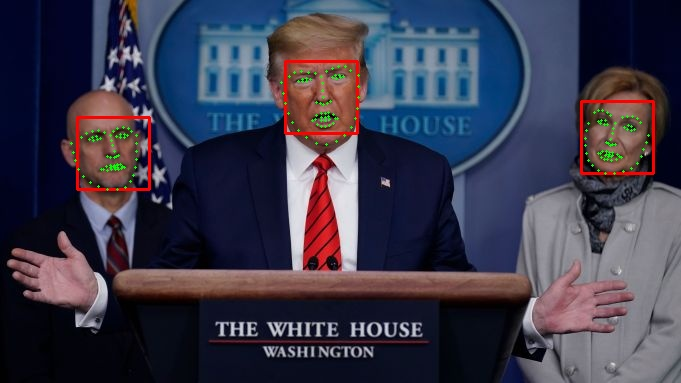

# Easy Face and Landmark Detection
Easy face and facial landmark detection using an image of your choice or your very own video cam!

All detected faces are bounded with a box and 68 common facila landmarks are draw onto the face.

This repo uses [dlib's](http://dlib.net/) state-of-the-art face recognition achieved with deep learning. The model has an accuracy of 99.38% on the [Labeled Faces in the Wild benchmark](http://vis-www.cs.umass.edu/lfw/).

## Face Detection Using an Image

```bash
$ detect_img.py --img <path-to-img>
```

Original Image             |  Output Image with Facial boundary & Landmarks
:-------------------------:|:-------------------------:
 |  


## Face Detection Using a Web Cam

Use your own web cam to pick up on faces. Press `q` key to quit 

```bash
$ detect_video.py
```

## Models
To find a face, the detection consists of a full frontal human face object detector, followed by another model that predicts landmarks, given a face. This landmark predictior is what we load in by default in each file, `shape_predictor_68_face_landmarks.dat`. More details on the models can be found on [their website](http://dlib.net/face_detection_ex.cpp.html).


## Requirements
- Python 3.7
- dlib==19.19.0
- imutils==0.5.3
- numpy==1.18.1
- opencv-python==4.1.0.25

Assuming you're in this directory, in your conda (or virtual) environment with python 3.7 installed just run:
```bash
$ pip install -r requirements.txt
```
